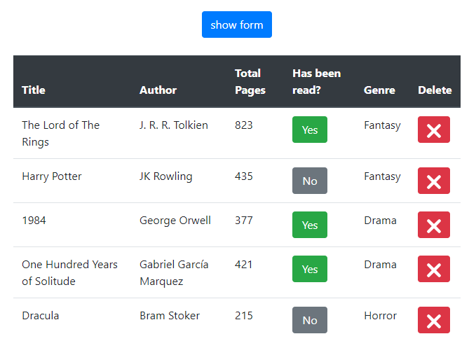

# Library! project

First JavaScript Microverse Project By Oscar Russi

# What it does

- It has a form to add more books.
- The book attributes are: title, author, number of pages, has been read and genre.
- It has a table with a list of books.
- the table shows all the information of each book, also has a button to toggle the value of "has been read" and another button to delete the book.
- A button in the top of the page to toggle between the table and the form.

# Build with

- HTML5/CSS
- JavaScript
- Bootstrap

# Live demo

[Live Demo](https://englishproject000.000webhostapp.com/ep/index.html)

# How to run this project

- Download this project or install running the next command in the terminal: git clone https://github.com/andresporras3423/library.git
- Move to the folder library
- Open in a browser the index.html file

#### and deployed to GitHub

## Authors

**Oscar Russi**
- Github: [@andresporras3423](https://github.com/andresporras3423/)
- Linkedin: [Oscar Russi](https://www.linkedin.com/in/oscar-andres-russi-porras)

## � Contributing

This is a project for educational purposes only. We are not accepting contributions.

## Attributions and Credit

Special thanks to Microverse, for this learning opportunity. 

## Show your support

Give a ⭐️ if you like this project!

## Enjoy!